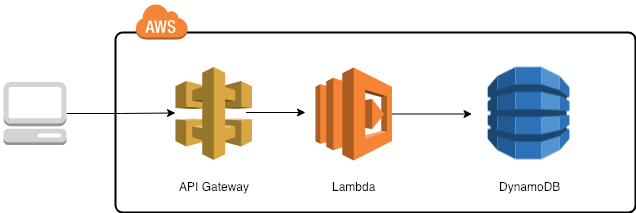

# aws-lambda-dynamodb-apigw-with-go

Building a `AWS lambda` function, written in `Golang` then hooking it up with `AWS Dynamodb` and later configuring `AWS AI Gateway` to cater request to the Lambda function.

This whole thing can be broken down into a few baby steps:

1. [AWS Lambda function using Go and deploy it](lambda-go)
2. [AWS Lambda function using Go, hooking up AWS DynamoDB and deploy it](dynamodb-lambda-go)

