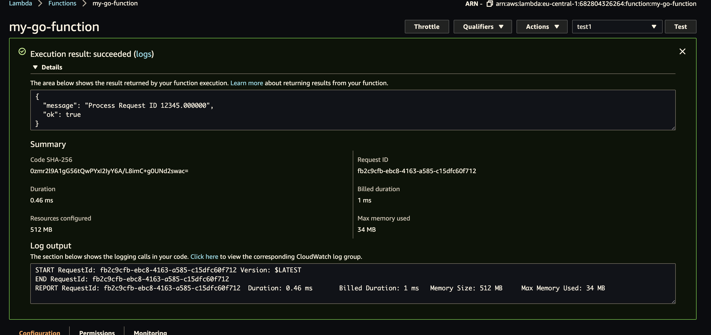

# aws-lambda-with-go

## Prereq:

Watch [this](https://www.youtube.com/watch?v=x_yCX4kSchY) video to setup and create a Go based AWS LAmbda function in the console - `my-go-function`. Then, follow teh next steps to build and upload the program into the console.

## Write the function
See [main.go](main.go) for details.

## Deploy Go Lambda functions with .zip file archives

Ref: https://docs.aws.amazon.com/lambda/latest/dg/golang-package.html

### Build, zip and upload

#### build the binary:
> GOOS=linux go build -o main

#### zip the binary
zip the binary created `main` to `main.zip`

#### upload the zip
goto the AWS console and navigate to the lambda function - `my-go-function` and upload in the **Function Code** section. 
**N.B.** Check that the handler is called `main` in the console, else change it as it's the name of the binary created.


## Deploy Go Lambda functions with container images
Ref: https://docs.aws.amazon.com/lambda/latest/dg/go-image.html


## Deploy Go Lambda functions with AWS CLI
Ref: https://www.alexedwards.net/blog/serverless-api-with-go-and-aws-lambda


## Testing
Goto the `Test` button on the top-right corner and craete a new test config.

Provide some event name like `test1` and use the below test input JSON
```json
{
  "id": 12345,
  "value": "some-value"
}
```
Once done, press the test button to see the test as below:


## Further reading

- AWS Lambda, AWS DynamoDB, IAM Role, AWS CLI and GO
https://www.alexedwards.net/blog/serverless-api-with-go-and-aws-lambda