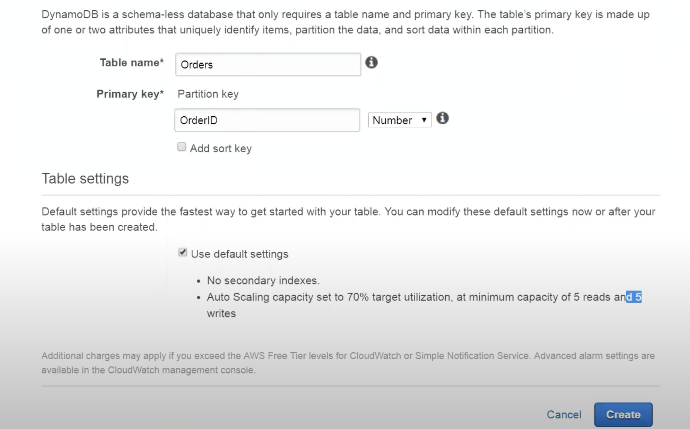

# dynamodb-lambda-go

See ref: https://www.alexedwards.net/blog/serverless-api-with-go-and-aws-lambda

## About Dynamodb

You can create a Dynamodb table using:
- AWS CLI
- AWS Console

> Using AWS CLI

The following AWS CLI example shows how to create a table (Music). The primary key consists of Artist (partition key) and SongTitle (sort key), each of which has a data type of String. The maximum throughput for this table is 10 read capacity units and 5 write capacity units.

**AttributeType=S denotes type is STRING**

```
aws dynamodb create-table \
    --table-name Music \
    --attribute-definitions \
        AttributeName=Artist,AttributeType=S \
        AttributeName=SongTitle,AttributeType=S \
    --key-schema \
        AttributeName=Artist,KeyType=HASH \
        AttributeName=SongTitle,KeyType=RANGE \
    --provisioned-throughput \
        ReadCapacityUnits=10,WriteCapacityUnits=5
```

> Using AWS Console




:rocket: As we see from above, while creating a table, you just need to specify:

- a table name
- a primary key attribute name and it's type

Every other `ITEMS` with value and type could be added later with their values like below:

```
$ aws dynamodb put-item \
    --table-name MusicCollection \
    --item '{
        "Artist": {"S": "No One You Know"},
        "SongTitle": {"S": "Call Me Today"} ,
        "AlbumTitle": {"S": "Somewhat Famous"} 
      }' \
    --return-consumed-capacity TOTAL

$ aws dynamodb put-item \
    --table-name MusicCollection \
    --item '{ 
        "Artist": {"S": "Acme Band"}, 
        "SongTitle": {"S": "Happy Day"} , 
        "AlbumTitle": {"S": "Songs About Life"} 
      }' \
    --return-consumed-capacity TOTAL

```
 ### Further reading

 https://docs.amazonaws.cn/en_us/amazondynamodb/latest/developerguide/WorkingWithDynamo.html


